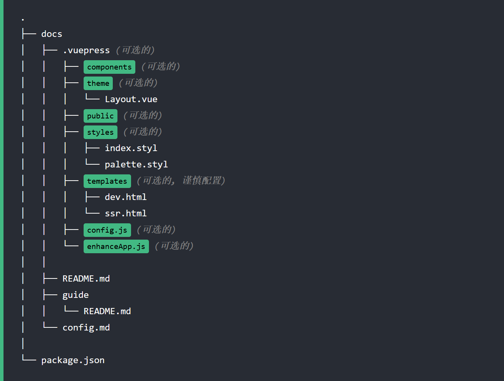

<p align="center">
  <a href="https://leafccc.github.io/" target="_blank">
    </a>
  </a>
</p>


### 一、关于本站

> 本站地址为[leafccc.github.io](https://leafccc.github.io)，其基于尤大的[vuepress](https://github.com/vuejs/vuepress)搭建，是一个纯前端的静态页面项目，上手简单，部署在github上的话十分方便，可以在短时间内迅速搭建起属于自己的一个简单博客。

### 二、教程

::: tip 提示
如果你有一定的Web开发基础，那么阅读[官方文档](https://vuepress.vuejs.org/zh/guide/getting-started.html)无疑是最好的学习方式，里面包含了从安装，开始到部署等一系列的教程。

当然，如果你只是一个像我一样的初学者，那么跟着我下面的一套，便能够解答你搭建过程中的所有疑问。
:::

#### 1. 前言
>  在上手前，我们来了解一下vuepress适合干什么。vuepress是一个静态网站生成器，静态即指没有后台数据库、不含程序和不可交互的网页，因此，其十分适合作为技术文档或者个人博客这类记录性质的用途。
在vuepress中，如果使用默认主题，你无需关注繁琐的Web前端的相关知识，包括路由，页面格式的编写等，你只需定义好文件路径，写好MarkDown文档，即可搭建一个简洁漂亮的页面。

#### 2. 安装与开始
(1) 选择一个目录并使用任意一个包管理器初始化
  
  ``` bash
  npm init # yarn init
   ```

这一步注意，我用的是npm，需要事先安装好。

(2) 将 VuePress 安装为本地依赖，注意，不推荐进行全局安装。
  ``` bash
  npm install -D vuepress # yarn add -D vuepress
   ```
::: warning 注意
   如果你的现有项目依赖了 webpack 3.x，作者推荐使用 [Yarn](https://classic.yarnpkg.com/zh-Hans/) 而不是 npm 来安装 VuePress。因为在这种情形下，npm 会生成错误的依赖树。
   :::
(3) 在文件夹内创建如下的目录结构

<p align="center">
    </a>
  </a>
</p>

以上是作者推荐的完整目录，而作为新手，我们只需创建必选的和可选的public目录即可。

::: warning 注意
请留意目录名的大写。
:::

- `docs/.vuepress`: 用于存放全局的配置、组件、静态资源等。
- `docs/.vuepress/components`: 该目录中的 Vue 组件将会被自动注册为全局组件。
- `docs/.vuepress/theme`: 用于存放本地主题。
- `docs/.vuepress/styles`: 用于存放样式相关的文件。
- `docs/.vuepress/styles/index.styl`: 将会被自动应用的全局样式文件，会生成在最终的 CSS 文件结尾，具有比默认样式更高的优先级。
- `docs/.vuepress/styles/palette.styl`: 用于重写默认颜色常量，或者设置新的 stylus 颜色常量。
- `docs/.vuepress/public`: 静态资源目录。
- `docs/.vuepress/templates`: 存储 HTML 模板文件。
- `docs/.vuepress/templates/dev.html`: 用于开发环境的 HTML 模板文件。
- `docs/.vuepress/templates/ssr.html`: 构建时基于 Vue SSR 的 HTML 模板文件。
- `docs/.vuepress/config.js`: 配置文件的入口文件，也可以是 `YML` 或 `toml`。
- `docs/.vuepress/enhanceApp.js`: 客户端应用的增强。

::: warning 注意
当你想要去自定义 `templates/ssr.html` 或 `templates/dev.html` 时，最好基于 [默认的模板文件](https://github.com/vuejs/vuepress/blob/master/packages/%40vuepress/core/lib/client/index.dev.html) 来修改，否则可能会导致构建出错。
:::

(4) 开始写作

首先在docs目录下的README.md文件下填写以下内容，对于各个字段可以自己修改查看效果。
``` md
---
home: true
heroImage: images/profilePhoto.jpeg
heroText: LeafCCC
tagline: Always be Avid
actionText: 个人介绍 →
actionLink: /guide/

---
::: slot footer
MIT Licensed | Copyright © 2022-present [LeafCCC](https://github.com/LeafCCC)
:::

```
之后，我们在.vuepress目录下的config.js文件中填写以下内容：
``` js
module.exports = {
    head: [
      ['link', { rel: 'icon', href: './images/logo.png' }] //设置标签处的图标 自己绘制了一个
    ],
    host: 'localhost', // ip
    port: '8101', //端口号 默认为8080
    
    themeConfig: {
      logo: '/images/logo.png',// 注意图片放在 public 文件夹下
      
      nav:[ // 导航栏配置
       {text:'Home', link:'/'},
       {text: 'About', link: '/about/'}, 
       {text: 'My github', link: 'https://github.com/LeafCCC'},   
      ],      
    },

    locales: {//语言配置
      // 键名是该语言所属的子路径
      // 作为特例，默认语言可以使用 '/' 作为其路径。
      '/en/': {
        lang: 'English', // 将会被设置为 <html> 的 lang 属性
        title: 'Hello, I\'m LeafCCC! (๑╹◡╹)ﾉ" ',
        description: 'LeafCCC\'s Web',
      },
      '/': {
        lang: '中文',
        title: '你好, 我是LeafCCC! (๑╹◡╹)ﾉ" ',
        description: 'LeafCCC的个人介绍网站',
      }
    },
  }
```
之后，我们在docs文件夹下创建guide文件夹，就可以创建对应我们/guide/路径的页面，在guide文件夹下创建README.md并且填写以下的内容:
```md
---
title: 个人介绍

---
## 👉 我

- 性别男，喜欢打打游戏，看看番，咸鱼一条。

## 💻 技术

- **编程语言:**&ensp;Python, C++
- **Web开发:**&ensp;Django, Vue
- **其他:**&ensp;MySQL, pyQt5


## 📚 教育经历

- 2017.09 - 2021.06&emsp; 上海交通大学&emsp; 本科 &emsp; &emsp;&ensp;  信息安全
- 2021.09 - 2024.03&emsp; 上海交通大学&emsp; 硕士在读&emsp; 电子信息(网络空间安全) 

## 🚀 获奖记录

- **2020年第十三届全国大学生信息安全竞赛-作品赛** &emsp;一等奖 &emsp;Linux勒索病毒防范软件

## 👨‍🔧 实习
 - 暂无实习经历

## 📝 工作意向
 - 大厂的后端岗皆可

## ✉️ 联系方式

- Email:  <a href="mailto:sjtu.zcc@outlook.com">sjtu.zcc@outlook.com</a>
- GitHub: <https://github.com/LeafCCC>
- Further: **有详细交流的需要可以邮箱后加vx即可**

---
title: 个人介绍

---
## 👉 我

- 性别男，喜欢打打游戏，看看番，咸鱼一条。

## 💻 技术

- **编程语言:**&ensp;Python, C++
- **Web开发:**&ensp;Django, Vue
- **其他:**&ensp;MySQL, pyQt5


## 📚 教育经历

- 2017.09 - 2021.06&emsp; 上海交通大学&emsp; 本科 &emsp; &emsp;&ensp;  信息安全
- 2021.09 - 2024.03&emsp; 上海交通大学&emsp; 硕士在读&emsp; 电子信息(网络空间安全) 

## 🚀 获奖记录

- **2020年第十三届全国大学生信息安全竞赛-作品赛** &emsp;一等奖 &emsp;Linux勒索病毒防范软件

## 👨‍🔧 实习
 - 暂无实习经历

## 📝 工作意向
 - 大厂的后端岗皆可

## ✉️ 联系方式

- Email:  <a href="mailto:sjtu.zcc@outlook.com">sjtu.zcc@outlook.com</a>
- GitHub: <https://github.com/LeafCCC>
- Further: **有详细交流的需要可以邮箱后加vx即可**


```
之后en以及about文件夹同理，可以参考我[github](https://github.com/LeafCCC/LeafCCC_BlogDev)上的内容，至此，文件的编写内容便完成了。
### 三、写在最后的碎碎念

> 一直有搭建一个属于自己的简单博客的想法，最近了解到了Vuepress(学了下发现简直是少儿编程hh, ps:尤大nb!)，于是乎便拿来练练手，也顺便熟悉了一下git的使用。因为本站是纯前端的项目，对后端数据库等锻炼不足，后续准备用Django+Vue重新搭建一个网站。